# Tech 258 - Docker

## Installing Docker on Windows
### Prerequisites
1) Make sure `Windows Subsystem for Linux` is enabled on your Machine. <br>
To do this:
- Search for `Turn Windows features on or off` on Search bar.
- Scroll down to `Windows Subsystem for Linux` and Tick it if not already ticked. Example: <br>

2) Click `OK` and Restart your machine to enable it!

### Steps to Install Docker
1) Download the installer using the download button at the top of this page [here](https://docs.docker.com/desktop/install/windows-install/).
2) Double-click `Docker Desktop Installer.exe` to run the installer.
3) When prompted, use `WSL 2` instead of `Hyper-V` option on the configuration page. (Make sure it's ticked)
4) Follow the instructions on the installation wizard to proceed with the install.
5) When the installation is successful, select `Close` to complete the installation process.
6) Restart your machine to make sure Docker is active and running from now on.
7) Check the docker version using the command:
```
docker --version
```
Example output: <br>
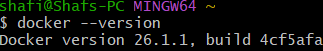

We put our images on Docker Hub so they're publicly available.

`docker pull` - Pull down an image from Docker Hub.

## How does Docker work?
Docker Client -> The terminal (LocalHost) who provides instructions e.g `docker run`

## Interacting with a container
Firstly we have to create a container from an image. Here's an example command below to do this with the `nginx` image.
```
docker run -d -p 80:80 nginx
```
Breaking the command flags down:
- `-d` - detached mode - run in background
- `-p` - attach ports e.g. 80:80
- `<image_name>` - e.g. nginx

Example output: <br>
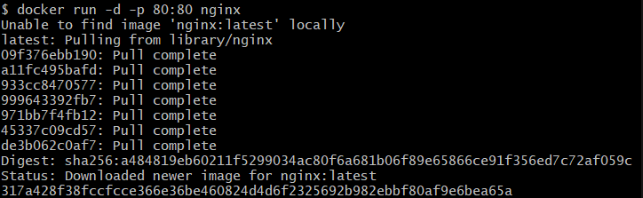

NOTE: We can also stop/start our container. Examples: <br>
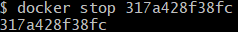 <br>
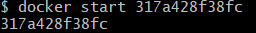


Now that we have the container running we want to interact with it. Run this command to do so: <br>
```
docker exec -it <container_ID> sh
```

Breaking the command flags down:
- `-it` - interactive mode
- `sh` - ssh (shell)

You may run into this error: <br>
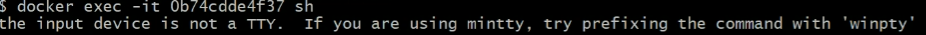 

To solve this, run the below command:
```
alias docker = "winpty docker"
```
`alias docker = "winpty docker"`

This container is fresh, meaning we have to install every package from scratch (even sudo!). The steps taken to do this are:
1) Run an update - `apt-get update`
2) Now we can install sudo - `apt-get install sudo`.
3) We can also install nano so we can edit files. - `sudo apt-get install nano`.
4) Now we can edit our Nginx template. First navigate to the right place - `cd /usr/share/nginx/html`
5) Edit the `index.html` file - `sudo nano index.html`

As we are doing this in a running container our changes happen in real time! We don't need to restart the `nginx` service like we did previously.
Changed example of the template: <br>
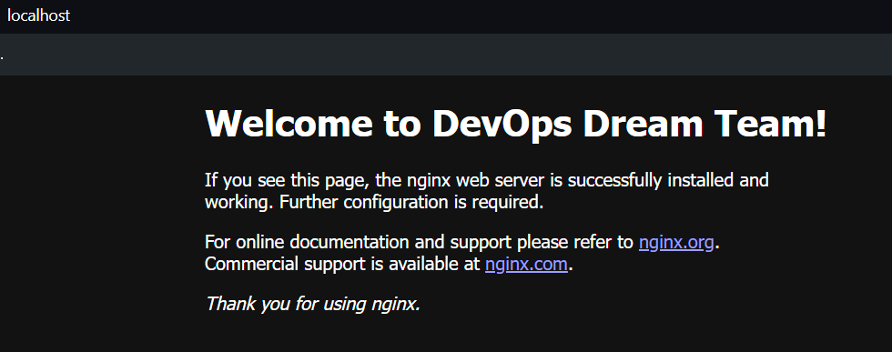

## Creating our own image
I have created my own `index.html` file on my local machine so to copy that into the running container, run the following command: 
```
docker cp /path/to/index.html <container_ID>:/usr/share/nginx/html/index.html
```
Example output: <br>
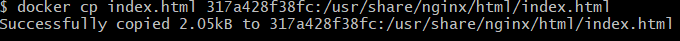

Now that we want to capture our running container's current state as an image. Run the following command:
```
docker commit <container_ID>
```
Example output: <br>
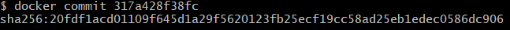

We can now see this in our `images` list. Run the following command:
```
docker images -a
```
The `-a` flag shows all images. Example output: <br>
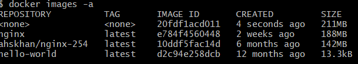

As you can see, our image doesnt have a `repository` name or `tag`. Let's change this with the following command:
```
docker tag <image_ID> <repository_name>:<tag_name>
```
Example output when checking image list again: <br>
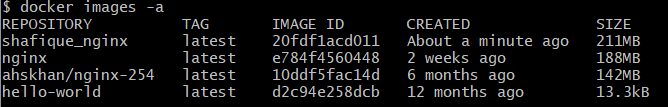

Now that we have our images ready to go we have to make a DockerHub repo.
1) Go to DockerHub > Repositories > Create repository
2) Enter the required fields and make sure it is `public` so others can use it!
Example repo: <br>
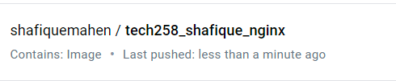

Now that the repo is created we can push our image to DockerHub! Run the following commands:
```
docker tag <local_repository_name> <dockerhub_username>/<dockerhub_repository_name>:<tag_name>
docker push <dockerhub_username>/<dockerhub_repository_name>:<tag_name>
```

This creates a tag for our image on the DockerHub repo and pushes it!
Example on DockerHub: <br>
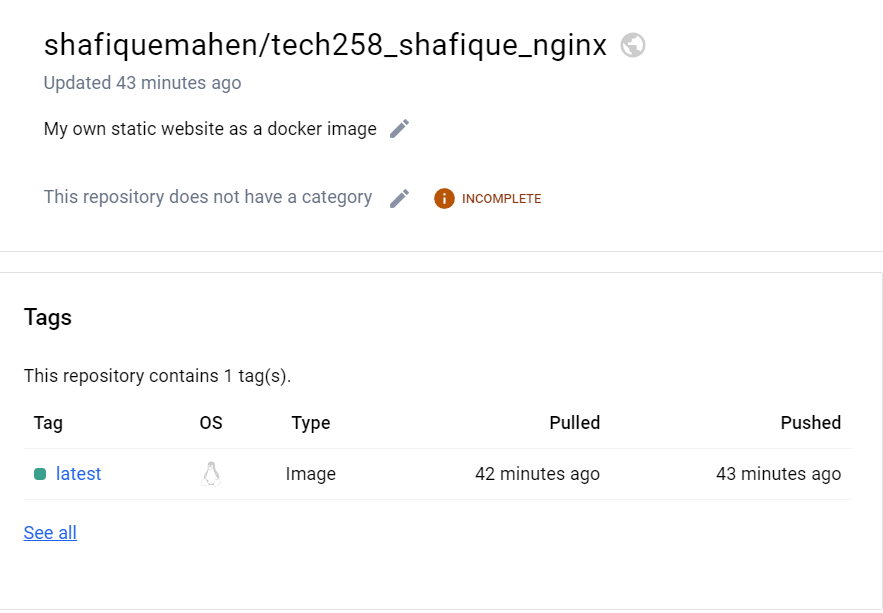