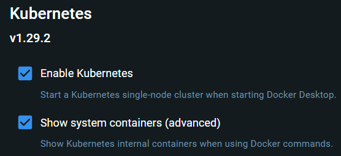
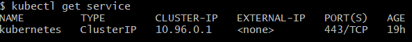
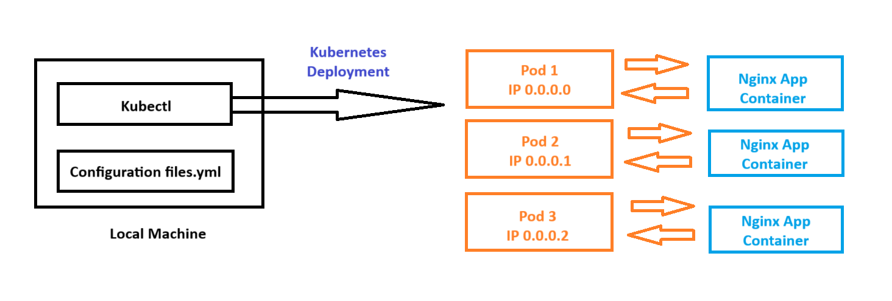
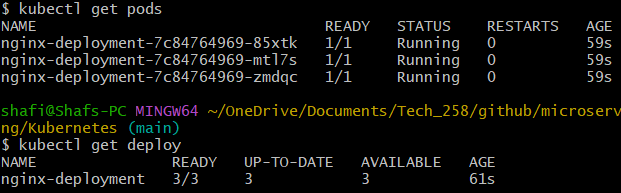
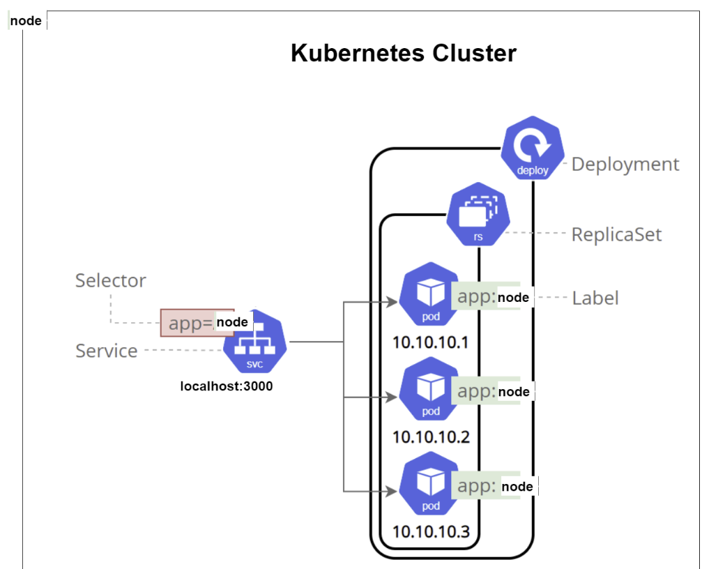
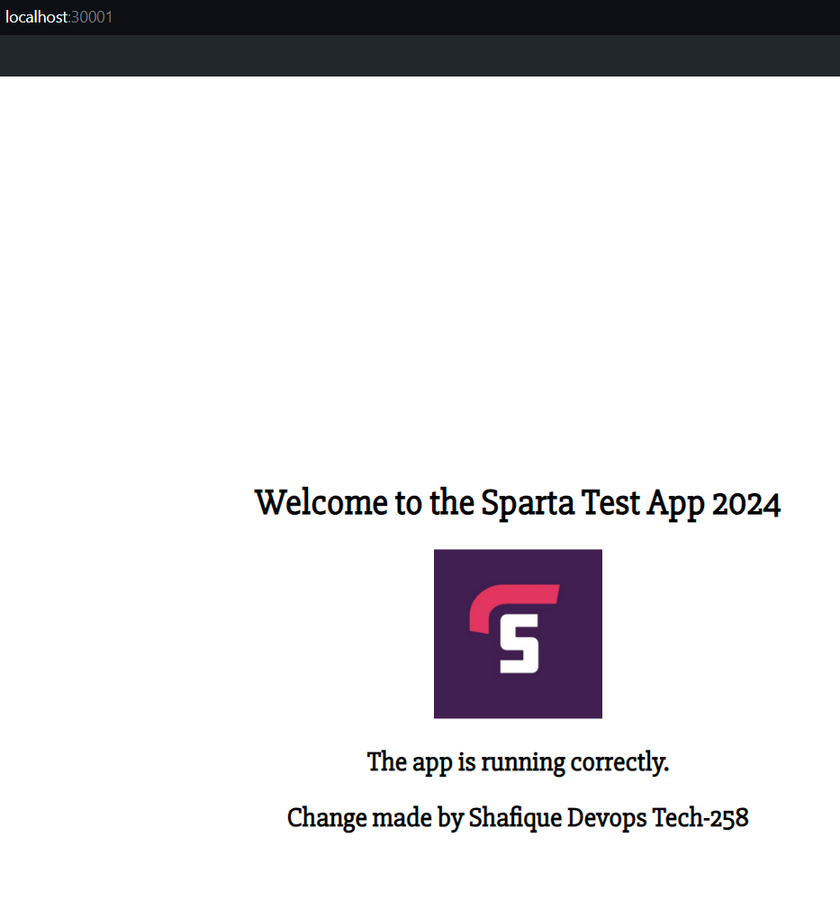
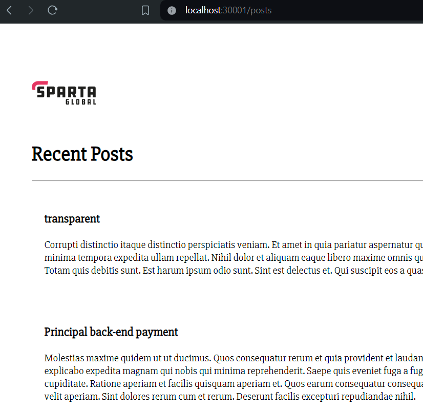

# Tech 258 - Kubernetes

## What is Kubernetes (K8s)?
Kubernetes is an open-source container orchestration platform designed to automate the deployment, scaling, and management of containerised applications. Initially developed by Google, Kubernetes is now maintained by the Cloud Native Computing Foundation (CNCF). Its primary purpose is to provide a robust framework to run distributed systems resiliently, with easy scaling, failover, and deployment strategies.

## Why use Kubernetes?
- **Scalability**: Automatically scale applications up or down based on demand.
- **Resilience**: Ensure high availability and fault tolerance.
- **Resource Optimisation**: Efficiently utilise resources and optimise infrastructure costs.
- **Automation**: Automate repetitive tasks such as deployment, scaling & updating.

## How does Kubernetes work?
Kubernetes abstracts the underlying hardware of nodes (servers) into a unified API, allowing you to manage and deploy your applications without worrying about the specifics of the underlying infrastructure. Here's a high-level overview of how Kubernetes operates:

1) **Cluster**: A Kubernetes cluster consists of a set of worker machines, called nodes, that run containerised applications.
2) **Control Plane**: The control plane manages the cluster, consisting of various components such as the API server, etcd (key-value store), scheduler, and controller manager.
3) **Nodes**: Each node runs a container runtime (e.g., Docker), kubelet (agent that communicates with the control plane), and kube-proxy (networking component).
4) **Pods**: The smallest deployable units in Kubernetes, which encapsulate one or more containers.
5) **Services**: Abstractions that define a logical set of pods and a policy for accessing them, often used to expose applications to the outside world.
6) **Namespaces**: Virtual clusters within a Kubernetes cluster to provide isolation for different projects or teams.

## Key Kubernetes Components
- **API Server**: Exposes the Kubernetes API.
- **etcd*: Distributed key-value store for storing cluster data.
- **Scheduler**: Assigns workloads to nodes based on resource availability.
- **Controller Manager**: Runs controllers to handle routine tasks like replication and node health monitoring.
- **Kubelet**: Runs on each node to manage container lifecycle.
- **Kube-proxy**: Handles network proxying and load balancing for services.
- **Container Runtime**: Software responsible for running containers (e.g. Docker).

## How to Install Kubernetes
1) Go to Docker Desktop > Settings > Kubernetes
2) Tick both options, then click Apply & Restart. Example: <br>

3) Kubernetes should now be installed!
4) You can check this by going to Git bash and typing the command:
```
kubectl get service
```
Example output: <br>


## Kubernetes Deployment
### Overview
A Kubernetes Deployment is a high-level abstraction that manages a set of identical pods, ensuring the desired number of replicas are running and available. Deployments provide a declarative way to manage the state of your applications, allowing you to define and update your application specifications through YAML configuration files.

Diagram: <br>


### Why use Deployments?
- **Self-healing**: Unhealthy/failed pods are automatically replaced.
- **Scaling**: Easily scale the number of replicas up or down to handle traffic changes.
- **Rolling updates**: Update your application seamlessly with zero downtime.
- **Rollbacks**: Revert to a previous version of the Deployment if the current version has issues.
- **Declarative Configuration**: Manage application state through version-controlled configuration files.

### What are the components of a Deployment?
- **Labels**: Key-value pairs attached to objects such as pods, which are used to identify/organise resources. To give an example, in the `nginx-deploy.yml` below: the label `app: nginx` is attached to the pod template, helping to identify and group the pods created by the deployment.
- **Selectors**: Allow Kubernetes to identify a set of objects based on their labels. To give an example, in the `nginx-deploy.yml` below: the selector `matchLabels: app: nginx` ensures that the deployment manages only the pods with the label `app: nginx`.
- **Pods**: The smallest deployable units in Kubernetes. Can contain one/multiple containers.
- **Replica Set**: Ensures a specified number of pod replicas are running at any given time.
### Steps
1) Create and outline our deployment with the command: `nano nginx-deploy.yml` <br>
Example file (nginx-deploy.yml):
```
---
apiVersion: apps/v1
kind: Deployment # Pod - service what kind of service
metadata:
  name: nginx-deployment # Deployment name
spec:
  selector:
    matchLabels:
      app: nginx # Look for this label to match with k8 service
  replicas: 3 # 3 pods
  template:
    metadata:
      labels:
        app: nginx # This label connects to the service or any other k8 components
    spec:
      containers:
      - name: nginx
        image: shafiquemahen/nginxtech258
        ports:
        - containerPort: 80
```
2) Create our deployment using the command: `kubectl create -f nginx-deploy.yml`
3) Check the status of our pods using the command: `kubectl get pods`
4) Check the status of our deployment using the command: `kubectl get deploy`
If it was successful, we would get this output: <br>


## Kubernetes Service
We now need to create a service to expose our `nginx` application. 
### Steps
1) We can create a NodePort service and configure it in a `nginx-svc.yml`.
Example file (nginx-svc.yml):
```
---
# Select the type of API version and kind
apiVersion: v1
kind: Service
# Metadata for name
metadata:
  name: nginx-svc
  namespace: default
# Specification to include ports and selector to connect service to deployment
spec:
  ports:
  - nodePort: 30001 # range is 30000 - 32768
    port: 80
    targetPort: 80
  # Define the selector to connect the service to the deployment
  selector:
    app: nginx
  # Define the type of service
  type: NodePort # Also use LoadBalancer - For local use ClusterIP
```
2) Create our deployment using the command: `kubectl create -f nginx-svc.yml`

## How to prevent downtime of our Deployment
If for example, we wanted to change the number of replica pods from 3 to 5 we would have to edit our `nginx-deploy.yml` file. Kubernetes will then have to take down the deployment and restart it with the new configuration, which could be bad for the business as the service may go down for a few seconds.

To avoid this we can edit our deployment whilst its running using the following command:
```
kubectl edit deploy nginx-deployment
```

## Deploying NodeJS App on a Single-Node Cluster
### Overview
We now want to create a deployment of our Node.js application on a single-node Kubernetes cluster. This means we will have to create a Kubernetes deployment `node-deploy.yml` and a NodePort service `node-svc.yml` configuration files to do this. Diagram to show the architecture: <br>


- **Node**: The single node where our application is deployed. It will be inside our Kubernetes Cluster.
- **Cluster**: This is the cluster that manages the deployment and scaling of the app.
- **Deployment**: Defines the desired state of our application, reflecteed in a YAML configuration file, e.g. number of replicas = 3.
- **Replica Set**: Ensures that the specified number of pod replicas are running at all times.
- **Pods**: Instances of your application. In this diagram, 3 pods will be created and will each run the Node.js application, identified by the label `node`.
- **Service**: Will be responsible for exposing the application to external traffic. This service will use a selector to match the pods with the label `app: node` and makes the application accessible at `localhost:30001`.

### Steps
1) Create the `node-deploy.yml` file.
2) Create the `node-svc.yml` file.
3) Use `kubectl` to create the deployment and service based of these files:
```
kubectl create -f node-deploy.yml
kubectl create -f node-svc.yml
```

Once deployed go to `localhost:30001` to see the application!
Example: <br>


## Deploying MongoDB
Now that we have our app up and running, let's setup our DB microservice and expose the pods to outside traffic (e.g. from the app) to facilitate communication between the microservices.

### Steps
1) Create the `mongo-deploy.yml` file.
2) Create the `mongo-svc.yml` file.
3) Use `kubectl` to create the deployment and service based of these files:
```
kubectl create -f mongo-deploy.yml
kubectl create -f mongo-svc.yml
```
4) Seed the database via one of our app pods using the command
```
kubectl exec <pod_name> env node seeds/seed.js
```

Once deployed go to `localhost:30001/posts` to see the application!
Example: <br>


## Full Script
```
---
apiVersion: apps/v1
kind: Deployment
metadata:
  name: mongo-deployment
spec:
  selector:
    matchLabels:
      app: mongo
  replicas: 1
  template:
    metadata:
      labels:
        app: mongo
    spec:
      containers:
      - name: mongo
        image: shafiquemahen/mongodb-3.2.20-customised
        ports:
        - containerPort: 27017
---
apiVersion: v1
kind: Service
metadata:
  name: mongo-svc
  namespace: default
spec:
  ports:
  - protocol: TCP
    port: 27017
    targetPort: 27017
  selector:
    app: mongo
---
apiVersion: apps/v1
kind: Deployment
metadata:
  name: node-deployment
spec:
  selector:
    matchLabels:
      app: node
  replicas: 3
  template:
    metadata:
      labels:
        app: node
    spec:
      containers:
      - name: node
        image: shafiquemahen/nodejs-app
        resources:
          limits:
            memory: "128Mi"
            cpu: "500m"
        ports:
        - containerPort: 80
        env:
        - name: DB_HOST
          value: "mongodb://mongo-svc.default.svc.cluster.local:27017/posts"
---
apiVersion: v1
kind: Service
metadata:
  name: node-svc
  namespace: default
spec:
  ports:
  - nodePort: 30001
    port: 80
    targetPort: 3000
  selector:
    app: node
  type: NodePort
```
## Cleanup
To remove our `deployment` and `service` that we have created (nginx & node) run the commands:
```
kubectl delete deploy <deployment_name>
kubectl delete svc <svc_name>
```